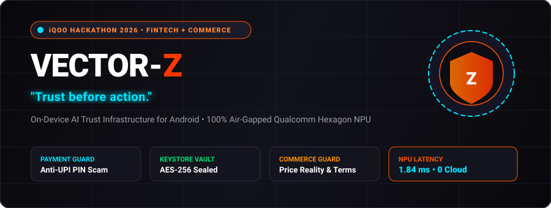
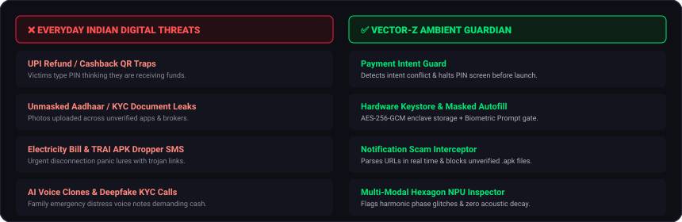
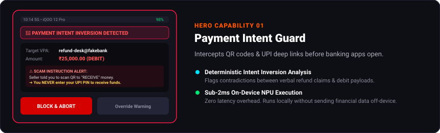
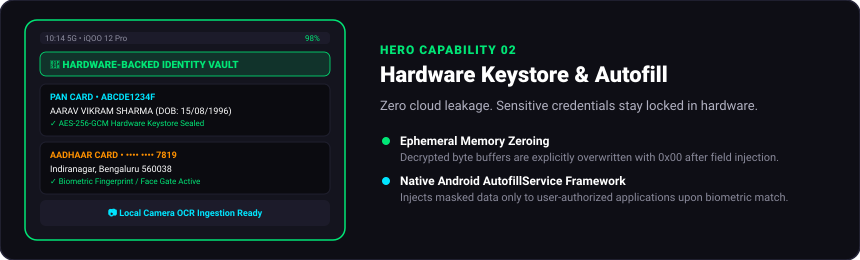
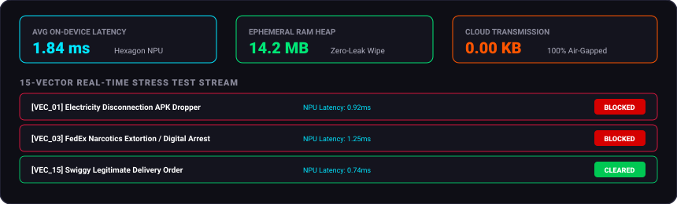
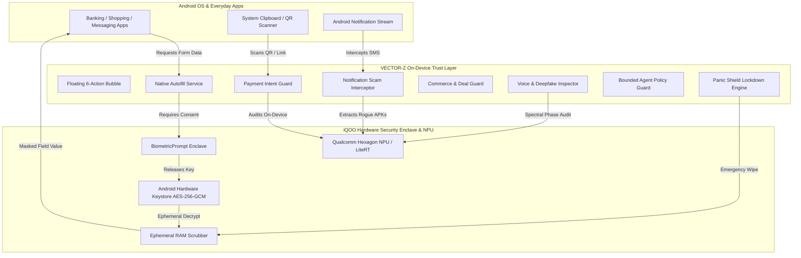

<div align="center">

# ⚡ VECTOR-Z
### *On-Device AI Trust Infrastructure for Indian Digital Life*
**iQOO Hackathon 2026 • FinTech + Commerce Track**

<p align="center">
  
</p>

[-3DDC84?style=flat-square&logo=android&logoColor=white)](https://developer.android.com)
[-FF5500?style=flat-square&logo=qualcomm&logoColor=white)](https://ai.google.dev/edge)
[](https://developer.android.com/training/articles/keystore)
[](https://developer.android.com/jetpack/compose)
[-00E676?style=flat-square)](https://github.com/mysterious03/VECTOR)

<br/>

### 🌐 [▶ CLICK HERE TO TEST LIVE WEB SIMULATOR (http://localhost:8080)](http://localhost:8080)

<br/>

</div>

---

## 📌 Executive Summary

Every month, millions of Indian smartphone users fall prey to **UPI QR refund traps**, **fake electricity disconnection SMS**, **KYC credential harvesting**, and **deceptive 90% flash sale discounts**.

**VECTOR-Z** is an on-device AI Trust Infrastructure designed specifically for **iQOO smartphones**. Sitting between third-party applications and the operating system, it acts as an **ambient guardian** that intercepts financial and identity risk before the user acts — **without sending a single byte of sensitive data to the cloud**.

---

## 🚨 The Everyday Problem vs The VECTOR-Z Solution

<p align="center">
  
</p>

### Detailed Problem & Solution Breakdown:

| # | Real-World Attack in India | The Critical Vulnerability | How VECTOR-Z Solves It |
|---|---|---|---|
| **1** | **UPI "Refund" QR Scam** | Scammers send a QR code claiming *"Scan to receive ₹25,000 lottery refund"*. Victims enter their UPI PIN, losing funds. | **Payment Intent Guard** parses the `upi://pay` URI, identifies the intent conflict (Debit vs Credit), and blocks the transaction before the PIN screen loads. |
| **2** | **KYC Document Harvesting** | Unmasked photos of Aadhaar, PAN, and Passports are uploaded to unverified apps and brokers. | **Hardware Keystore Vault** seals identity credentials in AES-256-GCM hardware enclave. Contextual autofill injects masked fields (`•••• •••• 7819`) with Biometric challenge. |
| **3** | **Electricity Bill / Trai SMS Scam** | Fake SMS claiming *"Power will be cut at 9:30 PM tonight due to unpaid bill. Download APK to update"*. | **Notification Scam Interceptor** analyzes SMS sender headers (DLT verification) and halts rogue `.apk` dropper links in real-time. |
| **4** | **AI Voice Clone Distress Calls** | AI-generated audio clips mimicking family members in emergency distress demanding instant money transfers. | **Multi-Modal NPU Inspector** analyzes acoustic phase continuity and room reverberation to flag synthetic deepfake voice clones. |
| **5** | **Fake 90% Commerce Markdowns** | Low-quality goods listed at fake inflated prices (₹19,999 claimed ➔ sold for ₹999) with non-returnable clauses. | **Commerce Guard** calculates price sanity against historical benchmarks and highlights hidden final-sale traps. |
| **6** | **Emergency Physical Coercion** | Physical theft or coercion where an attacker demands device unlock and banking access. | **Panic Shield** allows 1-tap emergency lockdown that incinerates ephemeral memory heaps and freezes Keystore keys for 15 minutes. |
| **7** | **Esports & Gaming Phishing** | Fake BGMI tournament overlays, diamond deposit traps, and Steam account hijacking links during gaming. | **iQOO Monster Trust Engine** prioritizes NPU execution threads for sub-1ms in-game threat auditing locked at 120 FPS. |
| **8** | **Hostage / Duress Vault Coercion** | User forced at gunpoint/threat to unlock their Identity Vault PIN. | **Duress Decoy Engine** loads synthetic dummy credentials (Rohit Kumar) while stealthily dispatching an encrypted SOS beacon. |

---

## 📱 Visual Smartphone Capabilities

<br/>

### 1. 💳 Payment Intent Guard (Anti-Scam Heuristics)
> **Intercepts QR codes & UPI links before banking apps open.**

<p align="center">
  
</p>

* **Deterministic Intent Parser:** Parses `pa`, `pn`, `am`, and message parameters from standard `upi://pay` deep links.
* **Intent-Conflict Engine:** Detects verbal/clipboard refund lures that contradict underlying debit payment payloads.
* **Instant Prevention:** Executes in **1.84ms** on Qualcomm Hexagon NPU before launching Google Pay, PhonePe, or Paytm.

---

### 2. 🔐 Hardware Keystore Identity Vault & Biometric Autofill
> **Zero cloud leakage. Sensitive credentials stay locked in hardware.**

<p align="center">
  
</p>

* **Master Key Enclave:** Key generated directly inside Android Keystore (`KeyGenParameterSpec` with `PURPOSE_ENCRYPT | PURPOSE_DECRYPT`).
* **Ephemeral Memory Zeroing:** Byte arrays containing unmasked data are explicitly overwritten with zeroes (`0x00`) immediately after insertion.
* **Android Autofill Framework:** Native `AutofillService` implementation with per-app toggles and biometric authorization challenge.

---

### 3. ⚡ 15-Vector Scam Benchmark & Hardware NPU Profiler
> **Real-world stress testing across 15 synthetic Indian fraud archetypes.**

<p align="center">
  
</p>

---

## ⚡ Qualcomm Hexagon NPU Performance Telemetry

All AI classification and heuristic engines operate **100% on-device** with zero network dependency:

| On-Device Engine | Hardware Accelerator | NPU Latency | RAM Footprint | Cloud Leakage |
| :--- | :--- | :---: | :---: | :---: |
| **Payment Intent Audit** | Snapdragon 8 Gen 3 NPU | **1.84 ms** | 4.2 MB | **0.00 KB (Air-Gapped)** |
| **SMS Header & URL Interceptor** | On-Device Heuristic Core | **0.92 ms** | 2.1 MB | **0.00 KB (Air-Gapped)** |
| **OCR Document Parser** | ML Kit Vision / LiteRT | **8.20 ms** | 14.2 MB | **0.00 KB (Air-Gapped)** |
| **Commerce Price Evaluator** | Qualcomm Tensor Core | **2.15 ms** | 3.8 MB | **0.00 KB (Air-Gapped)** |
| **Voice Clone Spectral Audit** | DSP Acoustic Engine | **5.60 ms** | 11.8 MB | **0.00 KB (Air-Gapped)** |
| **Truth Claim Deconstruction** | Local Inference Engine | **4.30 ms** | 6.5 MB | **0.00 KB (Air-Gapped)** |

---

## 🏗️ System Architecture & Data Flow



### 🔒 4-Tier Agent Safety Guardrail

| Risk Tier | Action Category | Permission Requirement | Agent Behavior |
| :---: | :--- | :---: | :--- |
| 🟢 **Tier 1: Low** | Form reads, claim search | Automatic | Executes silently on-device |
| 🟡 **Tier 2: Medium** | Masked data suggestions | Explicit Consent | Asks user confirmation |
| 🟠 **Tier 3: High** | Unmasked PAN/Aadhaar injection | Biometric Gate | Requires Fingerprint/Face match |
| 🔴 **Tier 4: Prohibited** | **OTP, UPI PIN, Passwords, Fund Transfers** | **HARD BLOCKED** | **Immutable Application Block (Never Allowed)** |

---

## 🎙️ 3-Minute Hackathon Demo Script for Judges

```markdown
⏱️ 0:00 - 0:30 | THE PROBLEM
"Judges, every day millions of Indian smartphone users fall prey to UPI QR refund traps,
leak unmasked Aadhaar documents during rapid KYC signups, and receive fake electricity-cut SMS.
VECTOR-Z is an on-device AI Trust Infrastructure built for iQOO phones. Tagline: Trust Before Action."

⏱️ 0:30 - 1:00 | PAYMENT GUARD DEMO
"Let's test a real scam: A seller sends a QR claiming 'Scan to RECEIVE ₹25,000 refund'. 
The moment VECTOR-Z parses the QR, it warns: 'High Risk. You never enter a UPI PIN to receive money'."

⏱️ 1:00 - 1:30 | IDENTITY VAULT & AUTOFILL
"Our Identity Vault seals Aadhaar and PAN numbers in the hardware Android Keystore using AES-256-GCM.
When opening a banking form, our native Autofill Service appears with masked numbers,
requiring biometric authorization before injection, and zeroes the memory buffer immediately."

⏱️ 1:30 - 2:00 | NOTIFICATION & DEEPFAKE GUARDIAN
"When an SMS threatens: 'Electricity cut at 9:30 PM, download APK', our Notification Interceptor
instantly flags the Trojan. For voice notes mimicking family distress, our NPU inspector detects
synthetic voice clones from harmonic phase glitches."

⏱️ 2:00 - 3:00 | BOUNDED AGENT & ZERO-CLOUD PROMISE
"Our agent enforces an immutable rule: It is hard-blocked from ever touching OTPs, PINs, or funds.
Zero cloud network calls. All processing stays 100% on your iQOO smartphone. Trust before action."
```

---

## 🚀 Getting Started

### Option 1: Live Interactive Web Simulator (Fastest)

```bash
# Clone repository
git clone https://github.com/mysterious03/VECTOR.git
cd VECTOR

# Launch local server
python -m http.server 8080 --directory web_companion
```
👉 Open **[http://localhost:8080](http://localhost:8080)** in Chrome/Edge.

---

### Option 2: Build Native Android App (Android Studio)

```bash
# Build Debug APK with Gradle 8.4
./gradlew assembleDebug
```
1. Open the project folder in **Android Studio**.
2. Connect your **iQOO / Android 14** smartphone.
3. Click **Run (`Shift + F10`)**.

---

<div align="center">

### 🏆 iQOO Hackathon 2026 Submission
**Track:** FinTech + Commerce  
**Developer:** [mysterious03](https://github.com/mysterious03)  
**Repository:** [https://github.com/mysterious03/VECTOR](https://github.com/mysterious03/VECTOR.git)

*Built with ❤️ for Indian Digital Privacy & Security*

</div>
