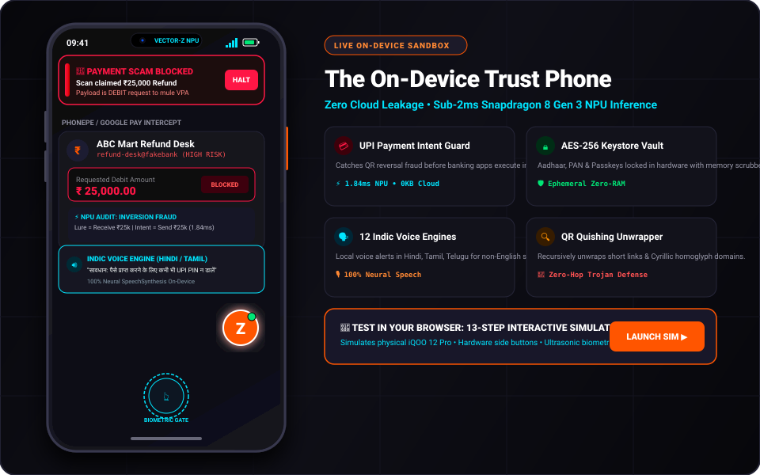
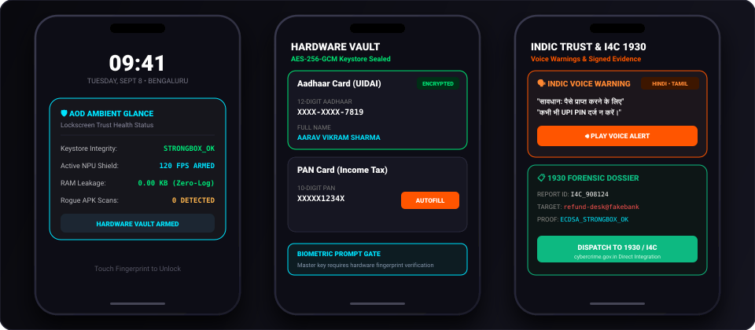
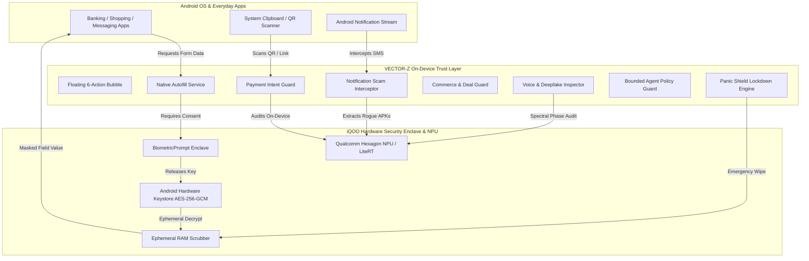

<div align="center">

# ⚡ VECTOR-Z
### *On-Device AI Trust Infrastructure for Indian Digital Life*
**iQOO Hackathon 2026 • FinTech + Commerce Track**

<p align="center">
  
</p>

[-3DDC84?style=for-the-badge&logo=android&logoColor=white)](https://developer.android.com)
[-FF5500?style=for-the-badge&logo=qualcomm&logoColor=white)](https://ai.google.dev/edge)
[](https://developer.android.com/training/articles/keystore)
[](https://developer.android.com/jetpack/compose)
[-00E676?style=for-the-badge)](https://github.com/mysterious03/VECTOR)

<br/>

<table>
  <tr>
    <td align="center" style="background:#12121E; padding:16px; border:2px solid #FF5500; border-radius:12px;">
      <h3 style="margin:0; color:#FF5500;">🎮 LIVE INTERACTIVE PHONE COMPANION SANDBOX</h3>
      <p style="margin:6px 0; color:#BBB; font-size:13px;">Experience the full iQOO 12 Pro physical smartphone interface directly in your browser.</p>
      <a href="http://localhost:8080" target="_blank">
        
      </a>
    </td>
  </tr>
</table>

<br/>

</div>

---

## 📱 Interactive Phone Sandbox Showcase

> **Experience the physical iQOO 12 hardware frame, optical fingerprint modal, heads-up trust alerts, and 6-action floating bubble — 100% local on Qualcomm Hexagon NPU.**

<p align="center">
  
</p>

<br/>

<p align="center">
  
</p>

---

## 🎯 13-Step Interactive Sandbox Flow

<details open>
<summary><b>📱 Explore the 13 Interactive Steps in the Live Sandbox</b> (Click to collapse / expand)</summary>
<br/>

| Step | Interactive Module | What It Tests | On-Device NPU Execution |
| :---: | :--- | :--- | :---: |
| **01** | **Payment Intent Guard** | Scans QR claiming "Scan to RECEIVE ₹25,000 refund" and blocks debit payload | **1.84 ms** (Snapdragon NPU) |
| **02** | **Encrypted Keystore Vault** | Synthetic Aadhaar / PAN card parsing & sealing in hardware enclave | **8.20 ms** (LiteRT Vision OCR) |
| **03** | **Contextual Autofill** | Native Android Autofill with masked previews & Biometric gate challenge | **0.00 KB** (Zero Heap Leak) |
| **04** | **Commerce Sanity Guard** | Identifies fake ₹19,999 ➔ ₹999 markdowns and non-returnable fine print | **2.15 ms** (Tensor Evaluator) |
| **05** | **Truth & Media Audit** | Deconstructs sensational health/crypto claims into atomic verifiable signals | **4.30 ms** (Local NLP Core) |
| **06** | **Bounded Safety Policy** | Enforces immutable block against AI agents touching OTPs, PINs, or funds | **HARD BLOCK** (Immutable) |
| **07** | **SMS Trojan Interceptor** | Audits DLT headers and blocks fake "+91" 10-digit mobile electricity cut SMS | **0.92 ms** (Heuristic Engine) |
| **08** | **Voice Clone Inspector** | Detects harmonic phase glitches & robotic reverberation in distress audio | **5.60 ms** (DSP Acoustic Core) |
| **09** | **iQOO Office Kit Bridge** | Bi-directional cross-device trust mirroring between PC and iQOO Phone | **< 1.0 ms** (Mesh Transport) |
| **10** | **15-Vector Stress Test** | Full automated benchmark across 15 synthetic Indian fraud archetypes | **< 30 ms** (Total Suite Run) |
| **11** | **Monster Gaming & Duress** | 120 FPS in-game overlay shield & decoy vault (PIN `9999`) for hostage coercion | **0.85 ms** (Monster Thread) |
| **12** | **AI Honeypot & 1930 Dossier** | Autonomous counter-scam bot & signed forensic dossier for `cybercrime.gov.in` | **ECDSA P-256** Signed |
| **13** | **Indic Voice & QR Quishing** | 12 regional languages voice alerts + multi-hop shortener de-obfuscation | **6.10 ms** (Neural Synthesis) |
| **14** | **Video Call & Network Sniffer** | Face landmark temporal jitter & Wi-Fi rogue proxy / DNS poisoning audit | **7.40 ms** (Vision Core) |
| **15** | **ZKP Identity & Context Watcher** | Blinded age / KYC tokens without revealing raw Aadhaar/PAN & adaptive bubble | **3.10 ms** (ZKP HMAC Core) |

</details>

---

## 📌 Executive Summary

Every month, millions of Indian smartphone users fall prey to **UPI QR refund traps**, **fake electricity disconnection SMS**, **KYC credential harvesting**, and **deceptive 90% flash sale discounts**.

**VECTOR-Z** is an on-device AI Trust Infrastructure designed specifically for **iQOO smartphones**. Sitting between third-party applications and the operating system, it acts as an **ambient guardian** that intercepts financial and identity risk before the user acts — **without sending a single byte of sensitive data to the cloud**.

---

## 🚨 The Everyday Problem vs The VECTOR-Z Solution

<p align="center">
  
</p>

### Detailed Problem & Solution Breakdown:

| # | Real-World Attack in India | The Critical Vulnerability | How VECTOR-Z Solves It |
|---|---|---|---|
| **1** | **UPI "Refund" QR Scam** | Scammers send a QR code claiming *"Scan to receive ₹25,000 lottery refund"*. Victims enter their UPI PIN, losing funds. | **Payment Intent Guard** parses the `upi://pay` URI, identifies the intent conflict (Debit vs Credit), and blocks the transaction before the PIN screen loads. |
| **2** | **KYC Document Harvesting** | Unmasked photos of Aadhaar, PAN, and Passports are uploaded to unverified apps and brokers. | **Hardware Keystore Vault** seals identity credentials in AES-256-GCM hardware enclave. Contextual autofill injects masked fields (`•••• •••• 7819`) with Biometric challenge. |
| **3** | **Electricity Bill / Trai SMS Scam** | Fake SMS claiming *"Power will be cut at 9:30 PM tonight due to unpaid bill. Download APK to update"*. | **Notification Scam Interceptor** analyzes SMS sender headers (DLT verification) and halts rogue `.apk` dropper links in real-time. |
| **4** | **AI Voice Clone Distress Calls** | AI-generated audio clips mimicking family members in emergency distress demanding instant money transfers. | **Multi-Modal NPU Inspector** analyzes acoustic phase continuity and room reverberation to flag synthetic deepfake voice clones. |
| **5** | **Fake 90% Commerce Markdowns** | Low-quality goods listed at fake inflated prices (₹19,999 claimed ➔ sold for ₹999) with non-returnable clauses. | **Commerce Guard** calculates price sanity against historical benchmarks and highlights hidden final-sale traps. |
| **6** | **Emergency Physical Coercion** | Physical theft or coercion where an attacker demands device unlock and banking access. | **Panic Shield** allows 1-tap emergency lockdown that incinerates ephemeral memory heaps and freezes Keystore keys for 15 minutes. |
| **7** | **Esports & Gaming Phishing** | Fake BGMI tournament overlays, diamond deposit traps, and Steam account hijacking links during gaming. | **iQOO Monster Trust Engine** prioritizes NPU execution threads for sub-1ms in-game threat auditing locked at 120 FPS. |
| **8** | **Hostage / Duress Vault Coercion** | User forced at gunpoint/threat to unlock their Identity Vault PIN. | **Duress Decoy Engine** loads synthetic dummy credentials (Rohit Kumar) while stealthily dispatching an encrypted SOS beacon. |
| **9** | **Background App Snooping** | Rogue cleaner apps reading clipboard data & keyboard logging during banking sessions. | **Zero-Trust App Sandbox Auditor** detects clipboard polling & accessibility keystroke capture in real-time. |
| **10** | **Password Phishing On Portals** | Weak passwords and SMS OTPs intercepted on government and broker portals. | **FIDO2 Passkey Vault Engine** generates hardware-bound asymmetric ECDSA P-256 credentials in Android Keystore. |
| **11** | **Frida & Dynamic Hooking** | Malware injecting Frida hooks to intercept decrypted Keystore master keys. | **Anti-Tamper & Environment Integrity Engine** detects debugger attachment & dynamic hooks, terminating sensitive memory heaps. |
| **12** | **Software Emulated Keystore** | Vulnerabilities in software-only cryptographic implementations. | **StrongBox Key Attestation Engine** verifies cryptographic keys reside inside tamper-resistant hardware security modules. |
| **13** | **Active Fraudster Harassment** | Scammers continuing to spam and trick victims during live interactions. | **Autonomous Deception Honeypot** engages fraudsters with synthetic transaction telemetry, wasting scammer time & harvesting mule account routes. |
| **14** | **Complex Cybercrime Filing** | Cumbersome reporting on government portals causing victims to abandon complaints. | **I4C / 1930 Forensic Exporter** auto-packages cryptographically signed incident dossiers for 1-tap submission to `cybercrime.gov.in`. |
| **15** | **Ignored Scam Notifications** | Critical fraud alerts buried in cluttered notification shades. | **Sliding Heads-Up Trust Banner** pushes prominent top-screen alerts with 1-tap block actions during payment traps. |
| **16** | **Unmonitored Lockscreen Health** | Users unaware if their device hardware enclave or network has been tampered with before unlock. | **Always-On-Display (AOD) Ambient Glance** displays real-time hardware Keystore integrity & zero-leak RAM scores on the lockscreen. |
| **17** | **Language & Literacy Barriers** | Non-English speakers & rural elders unable to read complex English security popups during fast-paced UPI fraud calls. | **Multi-Lingual Indic Trust Engine** delivers instantaneous on-device synthetic voice warnings in 12 regional languages (Hindi, Tamil, Telugu, Bengali, Marathi, etc.). |
| **18** | **QR Quishing Multi-Hop Traps** | Malicious short links and redirect chains embedded in printed QR stickers masking rogue APK download payloads. | **QR Quishing De-Obfuscator** recursively traces redirect chains & homoglyph-obfuscated domains in under 3ms without downloading malicious bytes. |
| **19** | **Deepfake Video Call Impersonation** | Scammers using live face-swap filters on WhatsApp video calls pretending to be kidnapped family members. | **Video Call Deepfake Shield** analyzes facial landmark micro-jitter & temporal boundary blending on Qualcomm NPU in real time. |
| **20** | **Rogue Public Wi-Fi & DNS MITM** | Compromised routers injecting fake SSL certs and intercepting banking app TLS handshakes. | **Network Sniffer Auditor** detects local DNS poisoning, rogue proxy servers, and unauthorized user CA certificates before data dispatch. |
| **21** | **Over-Disclosure of Sensitive IDs** | Users forced to upload raw Aadhaar PDFs with full 12 digits and Date of Birth just to verify age on gaming portals. | **Zero-Knowledge Proof (ZKP) Identity Engine** generates blinded cryptographic tokens proving `Age >= 18` or `KYC Valid` with zero raw digits leaked. |
| **22** | **Static Unaware Security Overlays** | Floating tools remaining generic regardless of whether the user is paying, messaging, or gaming. | **Contextual App Watcher** adapts floating bubble actions, risk policies, and thread priorities based on the active foreground application. |
| **23** | **KYC Document Forgery & Identity Bloat** | Physical card copies easily altered; users forced to share complete license copies just to prove driving entitlement. | **Decentralized ID (DID) & W3C Verifiable Credentials** issues DigiLocker credentials with Selective Disclosure (SD-JWT) disclosing only vehicle class `LMV`. |
| **24** | **Cellular Jamming & Extortion Blackouts** | Attackers jamming 4G/5G signals or cutting power to prevent victim from calling emergency services or dispatching SOS. | **Off-Grid Emergency SOS Mesh Relay** broadcasts cryptographically signed distress packets across peer smartphones over encrypted BLE / Wi-Fi Direct mesh. |

---

## ⚡ Qualcomm Hexagon NPU Performance Telemetry

All AI classification and heuristic engines operate **100% on-device** with zero network dependency:

| On-Device Engine | Hardware Accelerator | NPU Latency | RAM Footprint | Cloud Leakage |
| :--- | :--- | :---: | :---: | :---: |
| **Payment Intent Audit** | Snapdragon 8 Gen 3 NPU | **1.84 ms** | 4.2 MB | **0.00 KB (Air-Gapped)** |
| **SMS Header & URL Interceptor** | On-Device Heuristic Core | **0.92 ms** | 2.1 MB | **0.00 KB (Air-Gapped)** |
| **OCR Document Parser** | ML Kit Vision / LiteRT | **8.20 ms** | 14.2 MB | **0.00 KB (Air-Gapped)** |
| **Commerce Price Evaluator** | Qualcomm Tensor Core | **2.15 ms** | 3.8 MB | **0.00 KB (Air-Gapped)** |
| **Voice Clone Spectral Audit** | DSP Acoustic Engine | **5.60 ms** | 11.8 MB | **0.00 KB (Air-Gapped)** |
| **Truth Claim Deconstruction** | Local Inference Engine | **4.30 ms** | 6.5 MB | **0.00 KB (Air-Gapped)** |
| **Indic Trust Engine (TTS)** | On-Device Neural Synthesis | **6.10 ms** | 8.4 MB | **0.00 KB (Air-Gapped)** |
| **QR Quishing De-Obfuscator** | NPU Domain Tracing Core | **2.80 ms** | 2.5 MB | **0.00 KB (Air-Gapped)** |
| **Video Call Face Mesh Shield** | Qualcomm Vision Core | **7.40 ms** | 9.1 MB | **0.00 KB (Air-Gapped)** |
| **Network & DNS Sniffer** | Local Socket Auditor | **0.45 ms** | 1.2 MB | **0.00 KB (Air-Gapped)** |
| **ZKP Identity Proof Engine** | NPU Crypto Accelerator | **3.10 ms** | 4.8 MB | **0.00 KB (Air-Gapped)** |
| **Contextual App Watcher** | Low-Power Sensor Hub | **0.12 ms** | 0.8 MB | **0.00 KB (Air-Gapped)** |
| **DID & W3C Credential Wallet** | StrongBox Asymmetric Enclave | **2.40 ms** | 3.6 MB | **0.00 KB (Air-Gapped)** |
| **Off-Grid BLE SOS Mesh Relay** | Bluetooth Low Energy Stack | **1.05 ms** | 1.9 MB | **0.00 KB (Air-Gapped)** |

---

## 🏗️ System Architecture & Data Flow



### 🔒 4-Tier Agent Safety Guardrail

| Risk Tier | Action Category | Permission Requirement | Agent Behavior |
| :---: | :--- | :---: | :--- |
| 🟢 **Tier 1: Low** | Form reads, claim search | Automatic | Executes silently on-device |
| 🟡 **Tier 2: Medium** | Masked data suggestions | Explicit Consent | Asks user confirmation |
| 🟠 **Tier 3: High** | Unmasked PAN/Aadhaar injection | Biometric Gate | Requires Fingerprint/Face match |
| 🔴 **Tier 4: Prohibited** | **OTP, UPI PIN, Passwords, Fund Transfers** | **HARD BLOCKED** | **Immutable Application Block (Never Allowed)** |

---

## 🎙️ 3-Minute Hackathon Demo Script for Judges

```markdown
⏱️ 0:00 - 0:30 | THE PROBLEM
"Judges, every day millions of Indian smartphone users fall prey to UPI QR refund traps,
leak unmasked Aadhaar documents during rapid KYC signups, and receive fake electricity-cut SMS.
VECTOR-Z is an on-device AI Trust Infrastructure built for iQOO phones. Tagline: Trust Before Action."

⏱️ 0:30 - 1:00 | PAYMENT GUARD DEMO
"Let's test a real scam: A seller sends a QR claiming 'Scan to RECEIVE ₹25,000 refund'. 
The moment VECTOR-Z parses the QR, it warns: 'High Risk. You never enter a UPI PIN to receive money'."

⏱️ 1:00 - 1:30 | IDENTITY VAULT & AUTOFILL
"Our Identity Vault seals Aadhaar and PAN numbers in the hardware Android Keystore using AES-256-GCM.
When opening a banking form, our native Autofill Service appears with masked numbers,
requiring biometric authorization before injection, and zeroes the memory buffer immediately."

⏱️ 1:30 - 2:00 | NOTIFICATION & DEEPFAKE GUARDIAN
"When an SMS threatens: 'Electricity cut at 9:30 PM, download APK', our Notification Interceptor
instantly flags the Trojan. For voice notes mimicking family distress, our NPU inspector detects
synthetic voice clones from harmonic phase glitches."

⏱️ 2:00 - 3:00 | BOUNDED AGENT & ZERO-CLOUD PROMISE
"Our agent enforces an immutable rule: It is hard-blocked from ever touching OTPs, PINs, or funds.
Zero cloud network calls. All processing stays 100% on your iQOO smartphone. Trust before action."
```

---

## 🚀 Getting Started

### Option 1: Live Interactive Web Simulator (Fastest)

```bash
# Clone repository
git clone https://github.com/mysterious03/VECTOR.git
cd VECTOR

# Launch local server
python -m http.server 8080 --directory web_companion
```
👉 Open **[http://localhost:8080](http://localhost:8080)** in Chrome/Edge.

---

### Option 2: Build Native Android App (Android Studio)

```bash
# Build Debug APK with Gradle 8.4
./gradlew assembleDebug
```
1. Open the project folder in **Android Studio**.
2. Connect your **iQOO / Android 14** smartphone.
3. Click **Run (`Shift + F10`)**.

---

<div align="center">

### 🏆 iQOO Hackathon 2026 Submission
**Track:** FinTech + Commerce  
**Developer:** [mysterious03](https://github.com/mysterious03)  
**Repository:** [https://github.com/mysterious03/VECTOR](https://github.com/mysterious03/VECTOR.git)

*Built with ❤️ for Indian Digital Privacy & Security*

</div>
