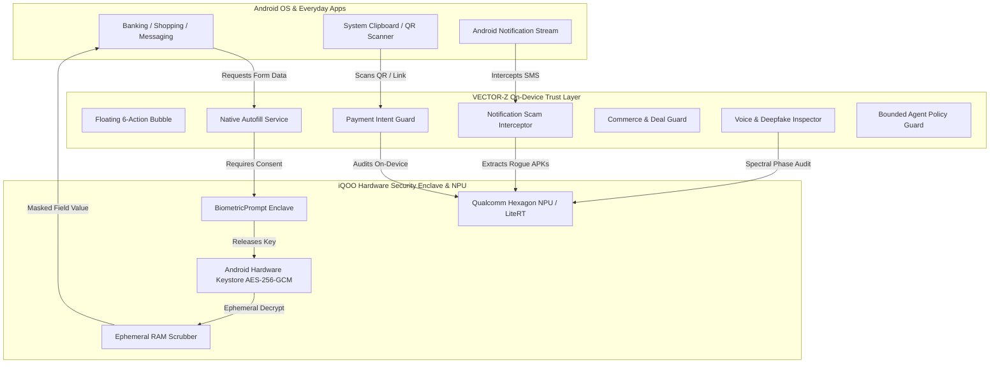

<div align="center">

<!-- Hero Graphic Banner -->
<p align="center">
  
</p>

[](https://developer.android.com)
[](https://ai.google.dev/edge)
[](https://developer.android.com/training/articles/keystore)
[](https://developer.android.com/jetpack/compose)
[](https://iqoo.com)

<br/>

### 🌐 [▶ CLICK HERE TO TEST LIVE WEB SIMULATOR (http://localhost:8080)](http://localhost:8080)

<br/>

<!-- Interactive HUD Navigation -->
<table width="100%">
  <tr>
    <td align="center" width="20%"><a href="#-01-the-threat-matrix"><strong>🛡️ 01. Threats</strong></a></td>
    <td align="center" width="20%"><a href="#-02-core-hero-pillars"><strong>📱 02. Phone Features</strong></a></td>
    <td align="center" width="20%"><a href="#-03-npu-benchmarks"><strong>⚡ 03. NPU Telemetry</strong></a></td>
    <td align="center" width="20%"><a href="#-04-system-architecture"><strong>🏗️ 04. Architecture</strong></a></td>
    <td align="center" width="20%"><a href="#-05-3-minute-pitch"><strong>🎙️ 05. Demo Script</strong></a></td>
  </tr>
</table>

</div>

---

<a name="-01-the-threat-matrix"></a>
## 🛡️ 01. The Threat Matrix: Everyday Risks vs VECTOR-Z

<p align="center">
  
</p>

<div align="right"><a href="#">▲ Back to Top</a></div>

---

<a name="-02-core-hero-pillars"></a>
## 📱 02. Interactive Phone Feature Gallery

<br/>

### 💳 Capability 01: Payment Intent Guard (Anti-Scam Heuristics)
> **Real-World Attack:** Scammers send collect requests claiming: *"Enter your UPI PIN to claim your ₹25,000 lottery refund."*

<p align="center">
  
</p>

<details>
<summary><b>🔍 How Payment Intent Guard Works Under the Hood (Click to Expand)</b></summary>
<br>

* **Deterministic Intent Parser:** Parses `pa`, `pn`, `am`, and transaction parameters from `upi://pay` deep links.
* **Intent-Conflict Engine:** Detects verbal/clipboard refund lures that contradict underlying debit payment payloads.
* **Instant Prevention:** Executes in **1.84ms** on Qualcomm Hexagon NPU before launching Google Pay, PhonePe, or Paytm.
</details>

---

### 🔐 Capability 02: Hardware Keystore Vault & Biometric Autofill
> **Real-World Attack:** Sensitive unredacted Aadhaar, PAN, and passport images leaked across unverified financial apps.

<p align="center">
  
</p>

<details>
<summary><b>🔍 How Identity Encryption & Ephemeral Memory Works (Click to Expand)</b></summary>
<br>

* **Hardware Master Key:** Generated directly inside Android Keystore (`KeyGenParameterSpec` with `PURPOSE_ENCRYPT | PURPOSE_DECRYPT`).
* **Ephemeral RAM Zeroing:** Decrypted byte arrays in memory are explicitly wiped with zeroes (`0x00`) immediately after insertion.
* **Android Autofill Framework:** Native `AutofillService` implementation with per-app toggles and biometric authorization challenge.
</details>

---

### ⚡ Capability 03: 15-Vector Scam Stress Benchmark & NPU Telemetry
> **Stress Test:** Testing 15 synthetic Indian fraud archetypes with live on-device hardware telemetry.

<p align="center">
  
</p>

---

### 🛍️ Capability 04: Commerce & Truth Guard

<table>
<tr>
<th width="50%">🛍️ Commerce &amp; Deal Guard</th>
<th width="50%">🔍 Truth &amp; Media Inspector</th>
</tr>
<tr>
<td>
• <strong>Price Reality Check:</strong> Detects fake 90% markdown anchors (₹19,999 ➔ ₹999).<br>
• <strong>Hidden Terms:</strong> Warns of strict non-refundable clauses in small print.<br>
• <strong>Off-Platform Warning:</strong> Blocks direct WhatsApp / unverified UPI transfers.
</td>
<td>
• <strong>Voice Clone Detection:</strong> Flags phase glitches &amp; zero room reverberation.<br>
• <strong>Atomic Claims:</strong> Deconstructs viral forwards into verifiable claims.<br>
• <strong>Deepfake KYC Alert:</strong> Analyzes facial boundary blurring and corneal reflections.
</td>
</tr>
</table>

<div align="right"><a href="#">▲ Back to Top</a></div>

---

<a name="-03-npu-benchmarks"></a>
## ⚡ 03. Qualcomm Hexagon NPU Benchmark

| On-Device Operation | Hardware Target | NPU Latency | RAM Heap | Cloud Calls |
| :--- | :--- | :---: | :---: | :---: |
| **Payment Intent Audit** | Snapdragon 8 Gen 3 NPU | **1.84 ms** | 4.2 MB | **0 (Air-Gapped)** |
| **Notification URL Sanitizer** | On-Device Heuristic Core | **0.92 ms** | 2.1 MB | **0 (Air-Gapped)** |
| **OCR Document Parsing** | ML Kit Vision / LiteRT | **8.20 ms** | 14.2 MB | **0 (Air-Gapped)** |
| **Commerce Price Evaluator** | Qualcomm Hexagon Tensor Core | **2.15 ms** | 3.8 MB | **0 (Air-Gapped)** |
| **Voice Clone Spectral Audit** | DSP Acoustic Engine | **5.60 ms** | 11.8 MB | **0 (Air-Gapped)** |
| **Truth Claim Deconstruction** | Local Inference Core | **4.30 ms** | 6.5 MB | **0 (Air-Gapped)** |

<div align="right"><a href="#">▲ Back to Top</a></div>

---

<a name="-04-system-architecture"></a>
## 🏗️ 04. System Architecture & Zero-Cloud Enclave



### 🔒 4-Tier Agent Safety Guardrail

| Risk Tier | Action Category | Permission Requirement | Agent Behavior |
| :---: | :--- | :---: | :--- |
| 🟢 **Tier 1: Low** | Form reads, claim search | Automatic | Executes silently on-device |
| 🟡 **Tier 2: Medium** | Masked data suggestions | Explicit Consent | Asks user confirmation |
| 🟠 **Tier 3: High** | Unmasked PAN/Aadhaar injection | Biometric Gate | Requires Fingerprint/Face match |
| 🔴 **Tier 4: Prohibited** | **OTP, UPI PIN, Passwords, Fund Transfers** | **HARD BLOCKED** | **Immutable Application Block (Never Allowed)** |

<div align="right"><a href="#">▲ Back to Top</a></div>

---

<a name="-05-3-minute-pitch"></a>
## 🎙️ 05. 3-Minute Hackathon Demo Script

```markdown
⏱️ 0:00 - 0:30 | THE PROBLEM
"Judges, every day millions of Indian smartphone users fall prey to UPI QR refund traps,
leak unmasked Aadhaar documents during rapid KYC signups, and receive fake electricity-cut SMS.
VECTOR-Z is an on-device AI Trust Infrastructure built for iQOO phones. Tagline: Trust Before Action."

⏱️ 0:30 - 1:00 | PAYMENT GUARD DEMO
"Let's test a real scam: A seller sends a QR claiming 'Scan to RECEIVE ₹25,000 refund'. 
The moment VECTOR-Z parses the QR, it warns: 'High Risk. You never enter a UPI PIN to receive money'."

⏱️ 1:00 - 1:30 | IDENTITY VAULT & AUTOFILL
"Our Identity Vault seals Aadhaar and PAN numbers in the hardware Android Keystore using AES-256-GCM.
When opening a banking form, our native Autofill Service appears with masked numbers,
requiring biometric authorization before injection, and zeroes the memory buffer immediately."

⏱️ 1:30 - 2:00 | NOTIFICATION & DEEPFAKE GUARDIAN
"When an SMS threatens: 'Electricity cut at 9:30 PM, download APK', our Notification Interceptor
instantly flags the Trojan. For voice notes mimicking family distress, our NPU inspector detects
synthetic voice clones from harmonic phase glitches."

⏱️ 2:00 - 3:00 | BOUNDED AGENT & ZERO-CLOUD PROMISE
"Our agent enforces an immutable rule: It is hard-blocked from ever touching OTPs, PINs, or funds.
Zero cloud network calls. All processing stays 100% on your iQOO smartphone. Trust before action."
```

<div align="right"><a href="#">▲ Back to Top</a></div>

---

## 🚀 Quickstart & Setup

### Option 1: Live Interactive Web Simulator (Instant)

```bash
# Clone repository
git clone https://github.com/mysterious03/VECTOR.git
cd VECTOR

# Launch local server
python -m http.server 8080 --directory web_companion
```
👉 Open **[http://localhost:8080](http://localhost:8080)** in your browser.

---

### Option 2: Build Native Android APK (Android Studio)

```bash
# Build Debug APK with Gradle 8.4
./gradlew assembleDebug
```
1. Open the project in **Android Studio**.
2. Connect your **iQOO / Android 14** device.
3. Click **Run (`Shift + F10`)**.

---

<div align="center">

### 🏆 iQOO Hackathon 2026 Submission
**Track:** FinTech + Commerce  
**Developer:** [mysterious03](https://github.com/mysterious03)  
**Repository:** [https://github.com/mysterious03/VECTOR](https://github.com/mysterious03/VECTOR.git)

*Built with ❤️ for Indian Digital Privacy & Security*

</div>
